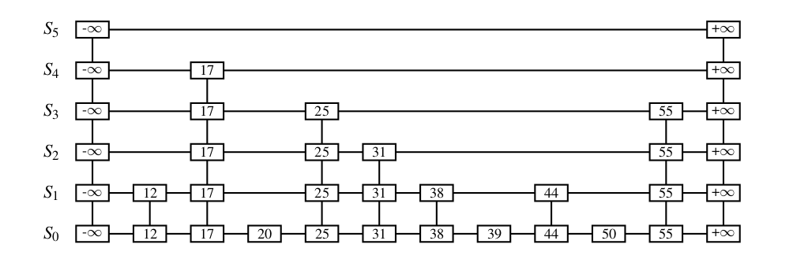

# Data structures and Algorithms

## 1. Cấu trúc dữ liệu

### 1.1 Cấu trúc dữ liệu cơ bản

#### 1.1.1 Skip list

Skip list là một probabilistic data structure xây dựng trên linked list dùng để lưu trữ một chuỗi đã sắp xếp sẵn n phần tử. Skip list có độ phức tạp thời gian trung bình cho các thao tác search, insert, delete đều bằng O(log n).

Một ví dụ về skip list:

Linked list S0 là một sorted linked list bình thường. Nếu search một phần tử trên S0 sẽ mất thời gian O(n). Skip list dùng thêm các linked list S1, S2, S3,... chứa một số phần tử của S0 để tăng tốc độ. Số lượng các list được gọi là level của skip list.

<ins>Cách xây dựng skip list từ linked list</ins>

Giả sử ta có một linked list S0 như ví dụ trên, ta sẽ build một skip list bằng cách lần lượt tạo ra S1, S2, S3,...

Lần lượt đi qua các phần tử trong S0, ta sẽ quyết định có thêm phần tử này vào S1 hay không bằng cách "flip a coin", nếu coin là head: thêm phần tử đang xét vào S1, ngược lại: bỏ qua. Cứ như vậy ta sẽ build được S1. Nhưng không dừng lại ở S1, ta lại đi qua các phần tử trong S1, "flip a coin" để tạo ra S2. Sau đó build S3, S4,... cho đến khi các list ở level cao hơn không còn phần tử nào nữa.

<ins>Level của skip list</ins>

Vì xác suất để coin là head là 50% nên số lượng phần tử ở Si+1 bằng khoảng 1/2 lượng phần tử ở Si . Vậy ta có lượng phần tử giảm một nửa sau mỗi level. Suy ra số lượng level là log2n+1 (with high probability).

<ins>Searching</ins>

Giống như tìm kiếm trên cây nhị phân, ta sẽ bắt đầu ở level cao nhất, sau đó đi sang phải hoặc go down tùy thuộc vào giá trị đang xét.

Giả xử với ví dụ trên, tìm 39:

- Ở level 4: 17 < 39, sang phải, không còn phần tử nào, go down 17
- Ở level 3: sang phải, 25 < 39, sang phải, 55 > 39, go down 25
- Ở level 2: sang phải, 31 < 39, sang phải, 55 > 39, go down 31
- Ở level 1: sang phải, 38 < 39, sang phải, 44 > 39, go down 38
- Ở level 0: sang phải, tìm thấy 39

Để tính số phép tính đã diễn ra trong quá trình searching, ta có thể đi back-ward in time, để tìm ra số lần go down và số phần sang phải. Ứng với một lần go down là một phần coin flip được mặt head, khi sang phải là flip coin được mặt tail. Số lần mặt head tối đa là số level của skip list, bằng log2n+1, vậy phải flip coin bao nhiêu lần để nhận được log2n+1 mặt head. Trung bình thì số lần tung sẽ gấp đôi số mặt head, suy ra số phép toán khi searching vào cỡ 2*(log2n+1).

Khi n thật sự lớn, việc tìm kiếm ở các list level cao sẽ "skip" qua rất nhiều phần tử ở S0, với high probability, skip list searching có độ phức tạp thời gian trung bình O(log n).

<ins>Insertion</ins>

Để thêm một phần tử vào skip list, đầu tiên, tìm kiếm vị trí để thêm phần tử vào S0 bằng searching. Sau khi thêm vào S0, ta sẽ "flip a coin", nếu coin là head: thêm phần tử vào S1, ngược lại: dừng thuật toán. Nếu phần tử được thêm vào S1, ta lại "flip a coin" để đưa phần tử "go up one level", nếu coin là head: thêm vào S2, ngược lại: dừng thuật toán. 

Vì số skip list có level O(log n) nên phần tử thêm vào chỉ có thể go up O(log n) level, cộng thêm quá trình searching để tìm ra vị trí insert, ta có skip list insertion có độ phức tạp thời gian trung bình O(log n).

<ins>Deletetion</ins>

Đơn giản hơn insertion, delete một phần tử khỏi skip list không đòi hỏi flip a coin, chỉ việc tìm kiếm phần tử đó rồi lần lượt đưa phần tử đó rời khỏi các list. Có một chú ý là sau khi delete có thể sinh ra các list rỗng, nên cần xóa các list rỗng này đi. Ví dụ ta xóa 17 trong skip list ở trên sẽ làm cho S4 rỗng, nên cần loại bỏ.

#### 1.1.2 Hash Map

### 1.2 Probabilistic data structures

#### 1.2.1 Bloom filters

#### 1.2.2 Cockoo filters

#### 1.2.3 Count Min sketch

#### 1.2.4 HyperLogLog

### 1.3 Trie

### 1.4 Cách chọn data structures phù hợp

## 2. Giải thuật

### 2.1 Search

#### 2.1.1 Linear search

#### 2.1.2 Quickselect

#### 2.1.3 Binary search

### 2.2 Sort

#### Quick sort

#### Bubble sort

### 2.3 Maths

#### 2.3.1 Fisher-Yates Shuffle

### 2.4 Cache

#### 2.4.1 LRU cache

#### 2.4.2 MRU cache

#### 2.4.3 LFU cache

## 3. Bài tập

### 3.1 Predictive text

### 3.2 Hash tables

## Tham khảo