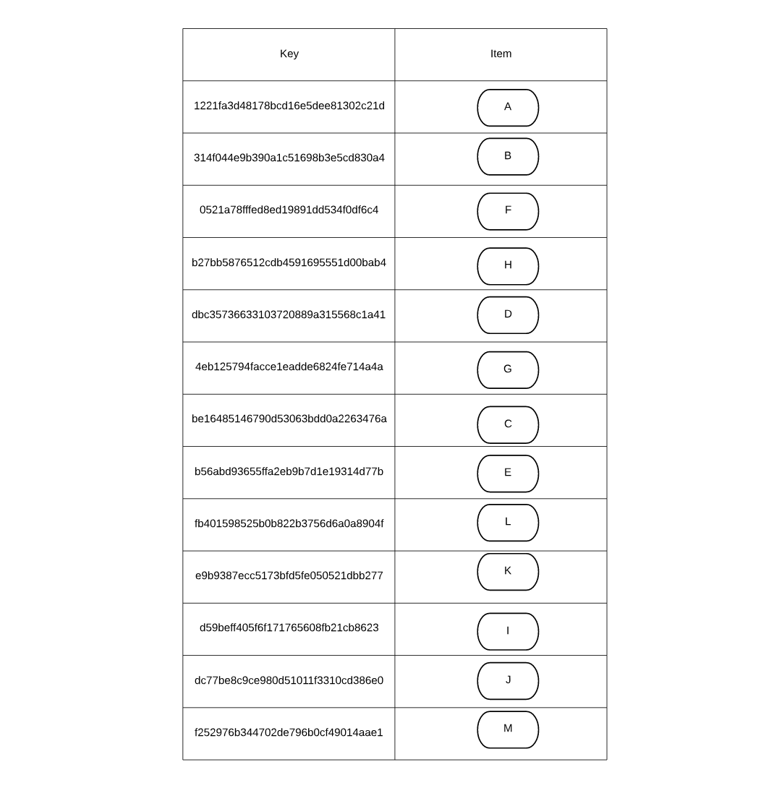
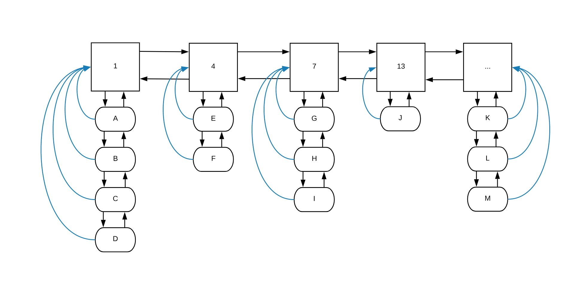

# Data structures and Algorithms

## 1. Cấu trúc dữ liệu

### 1.1 Cấu trúc dữ liệu cơ bản

#### 1.1.1 Skip list

Skip list là một probabilistic data structure xây dựng trên linked list dùng để lưu trữ một chuỗi đã sắp xếp sẵn n phần tử. Skip list có độ phức tạp thời gian trung bình cho các thao tác search, insert, delete đều bằng O(log n).

Một ví dụ về skip list:


Linked list S<sub>0</sub> là một sorted linked list bình thường. Nếu search một phần tử trên S<sub>0</sub> sẽ mất thời gian O(n). Skip list dùng thêm các linked list S<sub>1</sub>, S<sub>2</sub>, S<sub>3</sub>,... chứa một số phần tử của S<sub>0</sub> để tăng tốc độ. Số lượng các list được gọi là level của skip list.

<ins>Cách xây dựng skip list từ linked list</ins>

Giả sử ta có một linked list S<sub>0</sub> như ví dụ trên, ta sẽ build một skip list bằng cách lần lượt tạo ra S<sub>1</sub>, S<sub>2</sub>, S<sub>3</sub>,...

Lần lượt đi qua các phần tử trong S<sub>0</sub>, ta sẽ quyết định có thêm phần tử này vào S<sub>1</sub> hay không bằng cách "flip a coin", nếu coin là head: thêm phần tử đang xét vào S<sub>1</sub>, ngược lại: bỏ qua. Cứ như vậy ta sẽ build được S<sub>1</sub>. Nhưng không dừng lại ở S<sub>1</sub>, ta lại đi qua các phần tử trong S<sub>1</sub>, "flip a coin" để tạo ra S<sub>2</sub>. Sau đó build S<sub>3</sub>, S<sub>4</sub>,... cho đến khi các list ở level cao hơn không còn phần tử nào nữa.

<ins>Level của skip list</ins>

Vì xác suất để coin là head là 50% nên số lượng phần tử ở S<sub>i+1</sub> bằng khoảng 1/2 lượng phần tử ở S<sub>i</sub> . Vậy ta có lượng phần tử giảm một nửa sau mỗi level. Suy ra số lượng level là log<sub>2</sub>n+1 (with high probability).

<ins>Searching</ins>

Giống như tìm kiếm trên cây nhị phân, ta sẽ bắt đầu ở level cao nhất, sau đó đi sang phải hoặc go down tùy thuộc vào giá trị đang xét.

Giả xử với ví dụ trên, tìm 39:

- Ở level 4: 17 < 39, sang phải, không còn phần tử nào, go down 17
- Ở level 3: sang phải, 25 < 39, sang phải, 55 > 39, go down 25
- Ở level 2: sang phải, 31 < 39, sang phải, 55 > 39, go down 31
- Ở level 1: sang phải, 38 < 39, sang phải, 44 > 39, go down 38
- Ở level 0: sang phải, tìm thấy 39

Để tính số phép tính đã diễn ra trong quá trình searching, ta có thể đi back-ward in time, tìm ra số lần go down và số phần sang phải. Ứng với một lần go down là một phần coin flip được mặt head, khi sang phải là flip coin được mặt tail. Số lần mặt head tối đa là số level của skip list, bằng log<sub>2</sub>n+1, vậy phải flip coin bao nhiêu lần để nhận được log<sub>2</sub>n+1 mặt head. Trung bình thì số lần tung sẽ gấp đôi số mặt head, suy ra số phép toán khi searching vào cỡ 2*(log<sub>2</sub>n+1).

Khi n thật sự lớn, việc tìm kiếm ở các list level cao sẽ "skip" qua rất nhiều phần tử ở S<sub>0</sub>, với high probability, skip list searching có độ phức tạp thời gian trung bình O(log n).

<ins>Insertion</ins>

Để thêm một phần tử vào skip list:

- đầu tiên, tìm kiếm vị trí để thêm phần tử vào S<sub>0</sub> bằng searching.
- Sau khi thêm vào S<sub>0</sub>, ta sẽ "flip a coin", nếu coin là head: thêm phần tử vào S<sub>1</sub>, ngược lại: dừng thuật toán.
- Nếu phần tử được thêm vào S<sub>1</sub>, ta lại "flip a coin" để đưa phần tử "go up one level", nếu coin là head: thêm vào S<sub>2</sub>, ngược lại: dừng thuật toán. 
- ...

Vì skip list có level O(log n) nên phần tử thêm vào chỉ có thể go up O(log n) level, cộng thêm quá trình searching để tìm ra vị trí insert, ta có skip list insertion có độ phức tạp thời gian trung bình O(log n).

<ins>Deletetion</ins>

Đơn giản hơn insertion, delete một phần tử khỏi skip list không đòi hỏi flip a coin, chỉ việc tìm kiếm phần tử đó rồi lần lượt đưa phần tử đó rời khỏi các list. Có một chú ý là sau khi delete có thể sinh ra các list rỗng, nên cần xóa các list rỗng này đi. Ví dụ ta xóa 17 trong skip list ở trên sẽ làm cho S<sub>4</sub> rỗng, nên cần loại bỏ.

#### 1.1.2 Hash Map

Hash Map (hay Hash Table) là một cấu trúc dữ liệu sử dụng hash function để map một key với một value. Các value được lưu trong một mảng được gọi là buckets. Hash function là một hàm có đầu vào là một key, đầu ra là một index. Khi đưa một phần tử vào Hash Map, phần tử sẽ được đưa qua hash function, hash function sinh ra một index, value của phần tử sau đó được lưu ở buckets có vị trí index. Chức năng đầu tiên của Hash Map là "lookup", người ta muốn tìm một value khi có một key cho trước. Khi lookup, key đưa vào được hash thành mã index, vào buckets vị trí index sẽ tìm được value tương ứng.

Hash Map thường được dùng trong nhiều phần mềm, database, caches,...

Một ví dụ về hash map


Chúng ta cần một hash map để lưu a phone book (danh bạ điện thoại), cứ một tên trong danh bạ sẽ được gắn với một số điện thoại.

Đầu tiên tên danh bạ được hash thành mã index, rồi số điện thoại tương ứng sẽ được lưu ở buckets[index]. Ví dụ "John Smith" có số điện thoại 521-8976, khi đưa vào hash map, chuỗi "John Smith" được hash thành index 01, sau đó số điện thoại của "John Smith" được lưu lại buckets[01]. 

Khi muốn tìm kiếm số điện thoại của ai đó, chỉ cần đưa vào tên của người đó, hash map sẽ trả về số điện thoại tương ứng. Ví dụ: tìm số điện thoại của "Lisa Smith". Chuỗi "Lisa Smith" được hash thành mã index 02, hash map trả về kết qủa tại buckets[02] là 521-1234. Nếu tên người không nằm trong danh bạ, hash map có thể nhận biết được và trả về rỗng.

Trong điều kiện lý tưởng, thời gian lookup của hash map chỉ là hằng số O(1), không phụ thuộc vào số phần tử map.

Nhưng điều kiện này đòi hỏi hash function phải hash tất cả các key khác nhau thành các index khác nhau. Trên thực tế 2 key khác nhau có thể bị hash thành chung một index, khi đó đụng độ xảy ra. Hơn nữa số lượng index thì có hạn nhưng số key thì vô số kể nên việc đụng độ xảy là rất khó tránh khỏi.

<ins>Hash function</ins>

Hash function là một hàm số đầu vào một key, đầu ra là một index nằm trong đoạn [0, buckets_size-1]. Bình thường hàm hash sẽ diễn ra trong 2 bước:

```
hash = hash_function(key)
index = hash % buckets_size
```

Hàm hash_function thường độc lập với buckets_size nhưng sau đó kết quả của hàm này được re-range trong đoạn [0; buckets_size] nhờ phép chia lấy phần dư (%).

Ví dụ như key đầu vào là một chuỗi, hàm hash_function có là tính tổng của mã ASCII từng ký tự nhân cho vị trí của ký tự đó trong chuỗi.  
Cho chuỗi "hello", hàm hash_function("hello") sẽ trả về:  
'h'\*1 + 'e'\*2 + 'l'\*3 + 'l'\*4 + 'o'\*5 = 104\*1+101\*2+108\*3+108\*4+111\*5 = 1617  
Giả sử buckets_size = 200 => index = 1617 % 200 = 17

Một hash function tốt là một hash function ít gây ra đụng độ.

<ins>Load factor</ins>

```
load factor = n/k
```
- n là số lượng index bị chiếm trong buckets.
- k là buckets_size.

Khi càng nhiều phần tử trong buckets bị chiếm, khả năng xảy ra đụng độ càng cao, khi đó hash map trở nên chậm chạp hơn và có thể không còn họat động. Vì vậy việc kiểm soát load factor là rất quan trọng.

<ins>Giải quyết đụng độ</ins>

**Open addressing**: buckets không những lưu value mà lưu luôn cả key tương ứng. Khi một key mới được thêm vào vị trí index, nếu trong buckets[index] đã có sẵn key, so sánh key này với key mới, nếu 2 key khác nhau, tức đã xảy ra đụng độ, Open addressing sẽ tìm một vị trị trống khác trong buckets để lưu key mới và value tương ứng. Cách tìm vị trí mới phải tuân theo một nguyên tắc nhất định, để trong quá trình lookup có thể tìm lại được value tương ứng nếu dùng đúng quy tắc này.  
Một vài quy tắc tìm vị trí mới: 

- Linear probing: khi xảy ra đụng độ, index sẽ được tăng thêm một hằng số.
- Quadratic probing: index sẽ tăng thêm một số  bình phương sau mỗi lần đụng độ. (ví dụ như đụng độ lần một, tăng index lên 1, vẫn còn đụng độ, tăng index lên 4, lên 9,...).
- Double hashing: khoảng tăng lên của của index được tính bởi một hàm hash thứ 2.

Một ví dụ về giải quyết đụng độ dùng linear probing:


John Smith được hash vào buckets[152]  
Sandra Dee sau đó có cùng kết quả hashing là 152, nhưng chuỗi "Sandra Dee" thì khác chuỗi "John Smith", index được tăng thêm 1, bằng 153, vị trí còn trống, cặp key-value của Sandra Dee được lưu tại đây.  
Ted Baker có index hash bằng 153, xảy ra đụng độ, index tăng thêm 1 thành 154, vị trí này còn trống, cặp key-value của Ted Baker được lưu tai đây.

**Separate chaining**: mỗi buckets[index] lưu trữ một chuỗi những bộ key-value bị đụng bộ (same index).

Một ví dụ về giải quyết đụng độ dùng separate chaining:


John Smith và Sandra Dee có cùng mã hash index là 152 nên được lưu thành một linked list các phần tử tại buckets[152]. 

<ins>Analysis</ins>

Hash Map có thời gian lookup, insert và delete trung bình là O(1). Trong trường hợp xấu nhất, load factor gần băng 1, các quá trình giải quyết đụng độ không tốt, thời gian cho tất cả các thao tác trên Hash Map có thể lên tới O(n), do phải so sánh qua tất cả các phần tử đụng độ. Hash Map yêu cầu bộ nhớ O(n), thường thì buckets chứa nhiều hơn n phần tử khá nhiều.

### 1.2 Probabilistic data structures

Probabilistic data structures là những data structures cung cấp các đáp án ước lượng gần đúng hoặc sử dụng các phương pháp xác suất trong quá trình xây dựng cấu trúc dữ liệu

Is like a trade-off: Probabilistic data structures đánh đổi độ chính xác lấy tốc độ nhanh hơn, bộ nhớ ít hơn và khả năng implement dễ hơn.

#### 1.2.1 Bloom filters

Dùng để nhanh chóng quyết định xem một element có nằm trong một set hay không.

Bloom filter dùng nhiều hash function độc lập và một chuỗi bit 0; 1. 


Bloom filter ban đầu lưu trữ một chuỗi bit 0. Sau đó phần tử a<sub>1</sub> được thêm vào. a<sub>1</sub> được đưa qua 3 hàm hash để tìm ra 3 index, 3 vị trí index này được bật lên 1, đánh dấu a<sub>1</sub> đã nằm trong set. Tương tự như vậy khi thêm các phần tử a<sub>2</sub> và b.

Bloom filter không giải quyết đụng độ, nên đôi khi sẽ phán đoán sai. Một phần tử được cho là đã nằm trong set khi tất cả các bit sau hashing đều được bật lên 1. Ở ví dụ trên, tất cả các bit của nó đã được bật sẵn dù chưa thêm b vào. Khi này Bloom filter đã trả lời sai. Tỉ lệ sai của bloom filter được ước lượng vào cỡ:


Trong đó:

- n: số lượng element được đưa vào set.
- k: số lượng hash function.
- m: tổng lượng bit trong chuỗi bit.

Tỉ lệ sai này chỉ áp dụng trong trường hợp bloom filter trả lời "yes" (có tồn tại phần tử trong set). Nếu bloom filter trả lời "no" thì chắc chắn phần tử không có trong set (tỉ lệ sai 0%).

Bloom filter đưa ra câu trả lời rất nhanh trong thời gian O(k) (chỉ cần tính k hash function) và chiếm bộ nhớ cực kỳ ít, tùy thuộc vào tỉ lệ sai đã chọn.

Ví dụ: chọn tỉ lệ sai bằng 0.001, số filter bằng 4, số lượng phần tử là 100000. Khi đó ta cần số bit bằng 743500b. Vào cỡ 92kB. Nếu dùng một hash table bình thường, sẽ lưu trữ chừng vài mB bộ nhớ.

#### 1.2.2 Cockoo filters

Cũng như Bloom filter, Cuckoo filter dùng để test một phần tử có nằm trong một set hay không.

Cuckoo filter dựa trên Cuckoo hashing làm phương pháp xử lý đụng độ trong hashtable. 

<ins>Cuckoo hashing</ins>

Cuckoo hashing sử dụng 2 hàm hash độc lập và 2 dãy các buckets cho mỗi hash function.

Khi thêm một phần tử x vào set:

- Bắt đầu thêm x vào buckets thứ nhất, sử dụng hàm hash thứ nhất tính h<sub>1</sub>(x).
- Nếu h<sub>1</sub>(x) empty, thêm x vào vị trí đó.
- Nếu không, lấy phần tử tại h<sub>1</sub>(x) ra, thêm x vào vị trí đó, sau đó cố gắng thêm phần tử mới lấy ra vào buckets thứ 2.
- Thêm phần tử mới vào buckets thứ 2 dùng hàm hash thứ 2, quá trình này cứ tiếp diễn cho tới khi mọi phần tử được ổn định, thuật toán sẽ nhảy qua lại giữa 2 buckets.

Cuckoo hashing có khả năng rơi vào vòng lặp vô hạn (khi cứ lấy phần tử ra và thêm mới lại vào buckets). Cách duy nhất là rebuild lại hashtable, lấy lượng buckets lớn hơn hoặc thay đổi hàm hash.

<ins>Partial-key Cuckoo hashing</ins>

Cuckoo filter sử dụng Partial -key Cuckoo hash table để lưu trữ các "fingerprints" của những phần tử được insert. Fingerprint của một phần tử là một bit string lấy ra từ việc hash phần tử đó.

Cuckoo filter dùng một buckets chứa một chuỗi các bucket, mỗi bucket lại chứa các entry để lưu các fingerprint của phần tử.


Cuckoo hashing yêu cầu phải có phần tử ban đầu để rehash khi cần, trong khi Cuckoo filter chỉ lưu trữ fingerprint của phần tử nên không có cách nào để restore và rehash phần tử ban đầu. Partial-key cuckoo hashing là kỹ thuật được dùng để relocate fingerprint của phần tử khi cần.

Với một phần tử x, index của của 2 thành phần buckets được tính toán như sau:

    h<sub>1</sub>(x) = hash(x)
    h<sub>2</sub>(x) = h<sub>1</sub>(x) ⊕ hash(x's fingerprint)

⊕ là phép XOR 2 phần tử.

Phép XOR trên đảm bảo rằng h<sub>1</sub>(x) cũng có thể được tính từ h<sub>2</sub>(x) chỉ với fingerprint của phần tử. 

Thuật toán

```python
f = fingerprint(x);
i1 = hash(x);
i2 = i1 ⊕ hash(f);if bucket[i1] or bucket[i2] has an empty entry then
   add f to that bucket;
   return Done;

// must relocate existing items;
i = randomly pick i1 or i2;
for n = 0; n < MaxNumKicks; n++ do
   randomly select an entry e from bucket[i];
   swap f and the fingerprint stored in entry e;
   i = i ⊕ hash(f);
   if bucket[i] has an empty entry then
      add f to bucket[i];
      return Done;
      
// Hashtable is considered full;
return Failure;
```


Cuckoo filter được đánh giá là chiếm bộ nhớ ít hơn, tỉ lệ chính xác cao hơn Bloom filter. Hơn nữa Cuckoo filter còn hỗ trợ deleting element.

#### 1.2.3 Count Min sketch

Count Min Sketch dùng để đếm số lần một phần tử được đưa vào set.

Count Min sketch dùng nhiều hash fuction độc lập, ứng với mỗi hash function có là một mảng số đếm, bắt đầu từ 0.


Khi đưa một phần tử vào, phần tử sẽ được đưa qua tất cả các hàm hash và vị trí index tương ứng tại mảng đếm tương ứng sẽ được tăng thêm 1.


Giả sử ta đưa thêm một vài phần tử nữa vào


Thêm 1 phần tử nữa, vị trí index sau khi hash lần lượt là: 3, 4, 1, 6


Bây giờ chúng ta test thử chức năng đếm của Count Min sketch. Phần tử cần đếm sẽ được đưa qua các hàm hash và có kết quả lần lượt là: 3, 4, 1, 6. Lấy ra các giá trị tương ứng tại các mảng đếm: 1, 1, 1, 2. Sau đó lấy min của các giá trị này ta được giá trị cần tìm bằng 1. Vậy phần tử đã được thêm vào 1 lần. 

Tương tự như Bloom filter, Count Min sketch có thể trả lời sai nếu nhiều phần tử có cùng mã hash, vị trí index của mã hash đó sẽ được tăng thêm. Vậy để tăng độ chính xác cho Count Min sketch ta nên tăng thêm nhiều hàm hash, cùng với đó là tăng bộ nhớ để lưu thêm một mảng đếm tương ứng.

Count Min sketch có thời gian chạy O(k) và bộ nhớ O(m*k), được cho là rất tiết kiệm bộ nhớ.

#### 1.2.4 HyperLogLog

HyperLogLog một cấu trúc dữ liệu dùng để ước lượng có bao nhiêu phần tử khác nhau trong một set.


<ins>Probabilistic counting</ins>

Tương tự cách tính độ phức tạp backward in time của searching trong Skip list. Phải flip coin bao nhiêu lần để nhận được 10 head. Đáp án hợp lý nhất là 20. Áp dụng các số nhị phân, xét một set gồm các số nhị phân ngẫu nhiên 64 bit. Quan sát thấy có 10 số bắt đầu bằng bit 0. Ta có thể ước lượng có khoảng 20 số tự nhiên trong set, vì xác suất để một số tự nhiên bắt đầu bằng bit 0 là 50%. Còn nếu quan sát thấy có 6 số bắt đầu bằng "01" ta có thể ước lượng set có size bằng 24, vì chỉ có 25% khả năng một số bắt đầu bằng "01".

Ở HyperLogLog dùng một cách đếm tiết kiệm thời gian hơn, thay vì đếm số lượng những số bắt đầu bằng 1 dãy bit nào đó, cấu trúc dữ liệu này đếm số lượng leading zero lớn nhất trong set. Ví dụ quan sát thấy trong set maximum leading zero của một set thấy bằng 4, "0000". Hỏi có bao nhiêu phần tử trong set. Câu hỏi này tương tự như: "phải tung 1 đồng xu bao nhiêu lần để thu được 4 lần liên tiếp đều ngửa (head). Đán là 16 lần. HyperLogLog dựa trên phương pháp này để ước lượng số phần tử trong set.

Phần tử được đưa vào set sẽ qua một hash function, tính toán số lượng leading zero, nếu lớn hơn max leading zero hiện tại thì thay max bằng số mới. Sau cùng tại mọi thời điểm ta đều có thể ước lượng số lượng phần tử trong set nhờ số max này và kết quả bằng 2<sup>max</sup>.

Phương pháp tốn thời gian O(1) và bộ nhớ O(log max), tức chỉ phải lưu số lượng max leading zero. Mà số bit để biểu diễn max bằng log<sub>2</sub>(max), mà max lại bằng log<sub>2</sub>(size). Suy ra số bit lưư trữ chỉ bằng log<sub>2</sub>(log<sub>2</sub>(size)). Đây là nguồn gốc của cái tên LogLog.

<ins>**LogLog**</ins>

Phương pháp trên có sai số rất lớn, mà lại chỉ đưa ra đáp án là một lũy thừa của 2 (2, 8, 128, 1024,...). HyperLogLog dùng một phương pháp "tính trung bình" để tăng độ chính xác.

Lưu thêm các buckets chứa số lượng max leading zero. Các mã hash được chia thành 2 phần, một phần để quyết định index của bucket, phần còn lại dùng để đếm số leading zero.


Giả xử đầu ra của hàm hash là 8 bit nhị phân.  
HyperLogLog dùng 8 buckets để lưu max leading zero => có 3 bit quyết định index của bucket.  
Ví dụ trên hình, ta đang thêm phần tử "00101100" vào set.  
3 bit đầu bằng "001", vậy ta phải xem xét buckets[001], đang chứa số 0.  
Phần bit còn lại là "01100" có 1 leading zero, lớn hơn max hiện tại ở buckets[001] (bằng 0). Vậy cập nhật buckets[001] = 1.

Quá trình ước lượng sẽ tính trung bình của tất cả các buckets, giả sử được k => số lượng phần tử trong set là 2<sup>k</sub>

Phương pháp này tăng độ giảm sai số của kết quả còn 1.3/sqrt(number of buckets).

Researchers đã chỉ ra rằng, bỏ đi 30% những phần tử lớn nhất trong các buckets có thể giảm sai số xuống còn 1.05/sqrt(number of buckets), nhưng phương pháp này đòi hỏi phải sort các buckets.

<ins>**HyperLogLog**</ins>

HyperLogLog thực hiện một improve nữa, thay vì tính trung bình các buckets như bình thường, thuật toán sẽ tính trung bình bằng [harmonic mean](https://en.wikipedia.org/wiki/Harmonic_mean), phương pháp này giúp giảm sai số xuống còn 1.04/sqrt(number of buckets)


Với thời gian O(1) và bộ nhớ O(1) (nếu coi như số bucket là một số không đổi) HyperLogLog là một thuật toán tuyệt vời được dùng rất nhiều trong thực tế, đặc biệt là trong các hệ thống lớn, cần ước lượng với số lượng lên tới hàng triệu nhưng không cần chính xác tuyệt đối. Ví dụ như ước lượng số lượng user khác nhau ghé thăm một website, ước lượng số client khác nhau ghé thăm một webserver. Ước lượng số phần tử đã được cache,...

### 1.3 Trie

Trie là một prefix tree, một cây tìm kiếm dùng để lưu trữ các string.

Mỗi node trong Trie lưu trữ một ký tự, trừ node gốc. 


Một đường đi bất kỳ từ node gốc đến node lá cho ta một word. Ví dụ từ "bear". Lần lượt đi từ node gốc đến node "b", qua "e", "a" và node lá "r".

Từ "bear" và "bell" có chung phần prefix là "be" nên có chung đường đi lúc đầu, từ "b" rồi qua "e".

Trie rất hiệu quả về mặt bộ nhớ và thời gian searching cho một word. Hơn nữa còn có thể thực hiện một số chức năng rất mạnh khác như auto complete word.

Trie thường được implement giống B-tree. Một ví dụ:


Một node được đánh dấu thêm một biến isWord = true nếu node đó là kết thúc của một từ, ngược lại isWord = false.

<ins>Searching</ins>

Đi qua toàn bộ chuỗi cần tìm kiếm, cứ mỗi lần đi qua một ký tự, ta lại đi xuống một nhánh cây tương ứng với ký tự đó. Khi kết thúc chuỗi mà node đang đứng có isWord = true => chuỗi có trong trie, ngược lại => chuỗi không có trong trie.  

Trie searching mất thời gian O(m), m là độ dài chuỗi searching. Không phụ thuộc vào độ lớn của toàn bộ dữ liệu trong Trie.

<ins>Insertion</ins>

Gần tương tự như searching, ta đi qua toàn bộ chuỗi cần insert đồng thời di chuyển trên trie, khi gặp node lá ta tạo ra một nhánh cây mới chứa phần chuỗi còn lại. 

Trie Insertion cũng chỉ mất thời gian O(m), m là độ dài chuỗi cần insert.

<ins>Deletion</ins>

Deletion tương tự như insertion, trước tiên ta search chuỗi trong Trie, nếu node cuối cùng là node lá có isWord = true, ta xóa node lá này đi, nếu sinh ra các node lá có isWord = false thì ta cũng xóa những node này, tới khi gặp node lá có isWord = true hoặc node ko phải lá thì thôi. Nếu node cuối cùng không phải node lá nhưng có isWord = true, ta chỉ việc thay isWord = false. 

Trie Deletion cũng chỉ mất thời gian O(m), m là độ dài chuỗi cần delete.

<ins>Display</ins>

Muốn biểu diễn toàn bộ string trong Trie ta chỉ việc traversal theo kiểu depth-first-search. Mỗi khi gặp node, ta hoàn thành một word.

<ins>Usage and efficiency</ins>

Trie hay dùng trong các công cụ auto-completion, dùng thiết kế làm dictionary, spell checking, phone book, hay trong IP routing algorithms.

Tốc độ searching của Trie thường được so sánh là nhanh hơn hash table trong một số trường hợp, vì không cần phải giải quyết đụng độ, với thời gian O(m) không phụ thuộc vào độ lớn của data trong Trie.

Bộ nhớ dùng cho Trie là rất lớn, mỗi một ký tự ta phải dùng một node để lưu trữ. 

## 2. Giải thuật

### 2.1 Search

#### 2.1.1 Linear search


Là một thuật toán searching đơn giản, tìm một phần tử trong một chuỗi phần tử  bằng cách lần lượt đi qua tất cả các phần tử trong chuỗi rồi thực hiện phép so sánh cho tới khi "match".

Độ phức tạp thời gian: O(n), trung bình thuật toán mất (n+1)/2 phép so sánh.

Độ phức tạp bộ nhớ: O(1).

Mặc dù có độ phức tạp rất lớn (theo n) nhưng linear search rất dễ  để impelement, có thể được dùng để search trong các list nhỏ có ít phần tử.

#### 2.1.2 Quickselect

Quickselect là thuật toán dùng để tìm phần tử nhỏ nhất thứ k trong một chuỗi phần tử chưa được sắp xếp trước.

Ý tưởng chủ đạo: Chọn ra một phần tử pivot rồi chia mảng thành 2 mảng con: một mảng gồm những phần tử nhỏ hơn pivot, mảng còn lại gồm những phần tử lớn hơn pivot. Bước chia mảng này gọi là Partition. Tùy vào vị trí của pivot và vị trí cần tìm k, quickselect sẽ chọn lặp lại bước Partition trên mảng con lớn hoặc mảng con nhỏ. Mảng con ngày càng nhỏ đi, nhờ đó tìm ra phần tử k nhanh hơn.

pseudo code của Partition:

```cpp
algorithm partition(A, lo, hi) is
    pivot := A[⌊(hi + lo) / 2⌋]
    i := lo - 1
    j := hi + 1
    loop forever
        do
            i := i + 1
        while A[i] < pivot
        do
            j := j - 1
        while A[j] > pivot
        if i ≥ j then
            return j
        swap A[i] with A[j]
```

Sau khi pick ra phần tử pivot, partition dùng 2 con trỏ i, j chạy từ 2 đầu của mảng, con trỏ i tìm phần tử lớn hơn hoặc  bằng pivot, con trỏ j tìm phần tử nhỏ hơn hoặc bằng pivot, sau đó swap 2 phần tử này, cuối khi i >= j, mảng bên trái gồm toàn những phần tử nhỏ hơn hoặc bằng pivot, mảng bên phải gồm những phần tử lớn hơn hoặc bằng pivot. 

Partition có thời gian chạy O(n), bộ nhớ O(1).

Nếu vị trí của pivot lớn hơn k, chứng tỏ phần tử cần nằm ở mảng bên trái, ngược lại phần tử cần tìm nằm ở mảng bên phải.

C++ code:

```cpp
int partition(int arr[], int l, int r) 
{ 
    int x = arr[r], i = l; 
    for (int j = l; j <= r - 1; j++) { 
        if (arr[j] <= x) { 
            swap(arr[i], arr[j]); 
            i++; 
        } 
    } 
    swap(arr[i], arr[r]); 
    return i; 
} 
  
int quickSelect(int arr[], int l, int r, int k) 
{ 
    if (k > 0 && k <= r - l + 1) { 
  
        int index = partition(arr, l, r); 
  
        if (index - l == k - 1) 
            return arr[index]; 
  
        if (index - l > k - 1)  
            return quickSelect(arr, l, index - 1, k); 
  
        return quickSelect(arr, index + 1, r,  k - index + l - 1); 
    } 
  
    return INT_MAX; 
} 
```

Thuật toán quickselect là một thuật toán của Tony Hoare - cha đẻ của quicksort. Có cùng ý tưởng dùng hàm Partition như quicksort. 

Quickselect rất hiệu quả trong thực tế, với thời gian chạy trung bình tuyến tính O(n) và bộ nhớ chỉ O(1). Điểm yếu của quickselect là trong trường hợp xấu nhất, quickselect chạy trong thời gian O(n<sup>2</sup>). Tồn tại thuật toán tìm phần nhỏ nhất thứ k trong mảng trong thời gian O(n) (worst-case) nhưng quickselect có thời gian chạy trung bình thực tế tốt hơn.

#### 2.1.3 Binary search

Binary search là thuật toán tìm kiếm phần tử trong một mảng đã sắp xếp sẵn.

Ý tưởng chủ đạo: 

Ví dụ tìm phần tử 12 trong một mảng sắp xếp sẵn như sau:


Ta sẽ tận dụng mảng đã được sắp xếp sẵn để tăng tốc độ tìm kiếm.
- Đầu tiên "jump to the middle", so sánh 12 với phần tử ở giữa mảng. Ở đây 12 > 8, => 12 phải nằm ở bên phải của 8 trong mảng, nên ta không cần tốn công tìm kiếm phần mảng bên trái 8 nữa. Lượng công việc giảm đi 1 nửa. 
- Chỉ còn lại 5 phần tử cần phải xem xét, ta lại "jump to the middle", so sánh 12 với phần tử ở giữa, 12 < 14, suy ra ta có thể bỏ qua phần mảng bên phải 14.
- Cứ tiếp tục nhảy tới giữa mảng như vậy cho tới khi tìm được phần tử đúng. Mỗi lần "jump", mảng các phần tử còn lại chỉ bằng 1 nửa mảng cũ.

Trong trường hợp xấu nhất, chỉ còn lại 1 phần tử để xem xét, khi này thuật toán có thể kết luận là tìm thấy hay không. Binary search đã chia số phần tử mảng cho 2 mỗi lần jump để cuối cùng chỉ còn 1 phần tử, suy ra số lần chia 2 bằng log<sub>2</sub>n. 

Vậy thuật toán có độ phức tạp trong trong trường hợp xấu nhất là O(log n).

Binary search rất hiệu quả với thời gian logarithm và bộ nhớ O(1) nhưng chỉ có thể áp dụng trên những mảng đã được sắp xếp sẵn.

### 2.2 Sort

#### Quick sort

Quick sort là một thuật toán sắp xếp mảng dùng so sánh và phương pháp divide and conquer.

Ý tưởng chủ đạo của quicksort là pick một phần tử pivot trong mảng rồi chia mảng ra thành 2 mảng con: mảng các phần tử lớn hơn pivot và mảng các phần tử nhỏ hơn pivot (phần tử bằng pivot là trường hợp trivial, có thể được xử lý tùy lập trình viên). Sau đó tiếp tục phương pháp trên với 2 mảng con.

Khi mảng con có độ dài bằng 1, tức tất cả các phần tử nhỏ hơn sẽ nằm ở bên trái các phần tử lớn hơn, lúc đó toàn bộ mảng đã được sắp xếp. 

Pseudo code:

```cpp
quickSort(arr[], low, high)
{
    if(low < high)
    {
        pivot = partition(arr, low, high)

        quickSort(arr, low, pivot - 1);
        quickSort(arr, pivot + 1, high);
    }
}
```

Hàm partition dùng để đưa các phần tử nhỏ hơn pivot về bên trái pivot, khi đó các phần tử nằm bên phải sẽ chỉ còn lớn hơn hoặc bằng pivot.

```cpp
partition (arr[], low, high)

    pivot = arr[high];  
 
Khi mảng con có độ dài bằng 1, tức tất cả các phần tử nhỏ hơn sẽ nằm ở bên trái các phần tử lớn hơn, lúc đó toàn bộ mảng đã được sắp xếp. 
    i = (low - 1)  

    for (j = low; j <= high- 1; j++)
    {
       
        if (arr[j] < pivot)
        {
            i++;   
            swap arr[i] and arr[j]
        }
    }
    swap arr[i + 1] and arr[high])
    return (i + 1)
}
```
<ins>Analysis</ins>

Quicksort có độ phức tạp phục thuộc rất nhiều vào phần tử pivot chọn được. Trong trường hợp tốt nhất, pivot luôn là phần tử median, mảng luôn được chia thành 2 mảng bằng nhau, khi đó số lần chia 2 sẽ bằng  log<sub>2</sub>n, với hàm partition chạy trong O(n) => trong trường hợp này quicksort có độ phức tạp thời gian O(n log n).

Trong trường hợp xấu nhất, phần tử pivot là phần tử lớn nhất hoặc nhỏ nhất, 2 mảng có số phần tử là 1 và n-1, nếu cứ tiếp tục ta cần tới n-1 lần chia 2 mới kết thúc thuật toán, khi này quicksort có độ tạp O(n<sup>2</sup>).

Trong thực tế, quicksort có độ phức tạp thời gian trung bình O(n log n) và chạy nhanh hơn các thuật toán dùng so sánh khác vài lần (như merge sort, head sort) mà chỉ tốn bộ nhớ O(1).

#### Bubble sort

Bubble sort là một thuật toán sort dùng sắp xếp đơn giản.

Ý tưởng chủ đạo: lặp qua các phần tử nằm kề nhau trong mảng, nếu 2 phần tử nằm sai  vị trí (phần tử lớn nằm bên trái phần tử nhỏ) -> swap 2 phần tử đó. Thuật toán được gọi là "bubble" vì sau mỗi vòng lặp, phần tử lớn (hoặc nhỏ) sẽ trồi lên 2 đầu chuỗi, như bong bong nổi dần lên mặt nước.

Đoạn code bubble sort trong C++ được thực hiện đơn giản như sau:

```cpp
void bubbleSort(int arr[], int n)  
{  
    int i, j;  
    for (i = 0; i < n-1; i++)      
        for (j = 0; j < n-i-1; j++)  
            if (arr[j] > arr[j+1])  
                swap(&arr[j], &arr[j+1]);  
}  
```
Bubble sort có độ phức tạp thời gian trong mọi trường hợp là  O(n<sup>2</sup>) là có tổng số phép so sánh luôn bằng n*(n-1)/2 (không tính các phép so sánh trong điều kiện của vòng lặp for).

Khi không còn lệnh swap nào xảy ra => mảng đã được sắp xếp xong => ta có thể optimize bubble sort bằng cách ngừng thuật toán nếu trong một vòng lặp mà không xảy ra phép so sánh nào. Tuy vậy độ phức tạp của bubble sort trong trường hợp này vẫn là O(n<sup>2</sup>).

Với bộ nhớ sử dụng O(1), được đánh giá là thuật toán sắp xếp tệ nhất nhưng do ý tưởng đơn giản, dễ hiểu, tự nhiên, dễ implement nên Bubble sort trở thành thuật toán sắp xếp được yêu thích của các sinh viên lập trình (song song với đó là selection sort và interchange sort)

### 2.3 Maths

#### 2.3.1 Fisher-Yates Shuffle

Thuật toán đơn giản dùng để xáo trộn ngẫu nhiên một mảng các phần tử. 

Ý tưởng chủ đạo: lặp qua tất cả các phần tử, swap phần tử đó với một phần tử ngẫu nhiên còn lại trong mảng.

C++ code:

```cpp
void randomize (int arr[], int n)  
{  
    srand (time(NULL));   
    for (int i = n - 1; i > 0; i--)  
    {  
        int j = rand() % (i + 1);  
        swap(&arr[i], &arr[j]);  
    }  
}  
```

Thuật toán có phức tạp thời gian O(n), bộ nhớ O(1).

### 2.4 Cache

#### 2.4.1 LRU cache

Là một kỹ thuật loại bỏ những data cũ nhất trong cache (những data đã quá lâu không được truy xuất) để tạo khoảng trống cho các data mới.

Có nhiều cách để implement một LRU cache. Dưới đây sử dụng một cách quen thuộc.

Dùng một double linked list để lưu các phần tử . Khi một phần tử được truy xuất sẽ được mang lên đầu đầu list, dồn các phần còn lại xuống dưới. Khi đó ta có phần tử tail của list là phần tử ít dùng nhất, để loại bỏ phần tử này chỉ tốn thời gian O(1). Khi thêm một tử mới, phần tử sẽ được thêm vào đầu list, nên thời gian thêm vào cũng chỉ tốn O(1). Nhưng thời gian truy xuất tới một phần tử bất kỳ có thể mất tới O(n).


Dùng thêm một hash map để lưu địa chỉ mỗi các phần tử trong linked list. Khi đó thời gian truy xuất tới mọi phần tử chỉ mất O(1). Xóa một tử khỏi hash map cũng chỉ mất thời gian O(1) (áp dụng với hash map xử lý đụng độ bằng linked list). 


Tổng kết ta có performance cho implement trên như sau:

| Cost | |
|-----------------------------------|-----------|
| | Worst case |
| space | O(n) |
| delete least recently used item | O(1) |
| add new item | O(1) |
| access item | O(1) |

Động lực đằng sau LRU rất rõ ràng và rất tự nhiên: xóa đi những phần tử cũ nhất. Nên LRU được dùng rất rộng rãi trong loại cache khác nhau: web cache, disk cache,...

#### 2.4.2 MRU cache

Ngược lại với LRU, MRU loại bỏ những phần tử mới được truy cập gần nhất.

Implement tương tự LRU, chỉ đổi ngược lại, thay vì các phần tử mới truy cập đưa lên đầu mảng, bây giờ sẽ mang xuống cuối mảng.

MRU được dùng trong nhiều trường hợp các data cũ có khả năng được truy suất nhiều hơn các data mới.

#### 2.4.3 LFU cache

Một kỹ thuật tương tự như LRU, LFU loại bỏ phần tử có số lần truy xuất thấp nhất. 

Để maintain số lần truy cập, implement của LFU cũng phức tạp hơn LRU rất nhiều.

Dưới đây trình bày một implement khá dễ hiểu với chi phí cho mọi hoạt động đều bằng O(1).

Thuật toán dùng 2 double linked list và một hash table. 

Hash table dùng để lưu các phần tử (item). Ở đây key là một mã hash nhận dạng của item đó. Để cho ta có thể lưu key là bất cứ thứ gì sao cho khi muốn access tới một item thì ta chỉ cần mã key đó. Hash table đảm bảo thời gian truy xuất một phần tử là O(1)



Để maintain số lần truy xuất tới một phần tử , ta cần một double linked list lưu số lần truy xuất theo thứ tự tăng dần, gọi là 'frequency list', mỗi phần tử trong list này trỏ tới một double linked list chứa các item có số lần truy xuất bằng giá trị của phần tử trong frequency list. Linked list chứa các item gọi là item list.



Điều đặc biệt là mỗi phần tử trong item list ngoài 2 con trỏ (next và pre) thì còn thêm một con trỏ nữa trỏ tới phần tử cha của nó trong frequency list.

Khi một phần tử được truy xuất, số lần truy xuất sẽ phải tăng thêm một. Ta có thuật toán tăng số lần truy xuất của phần E như sau:

- Dùng hash table truy cập tới phần tử  E
- Dùng con trỏ truy cập tới item trong frequency list, từ đó biết được phần tử frequency tiếp theo (frequency hiện tại bằng 4, tiếp theo bằng 5).
- Nếu phần tử frequency tiếp là liên tiếp với phần tử frquency hiện tại (tồn tại một frequency item bằng 5), ta push item E làm phần tử đầu tiên trong item list của phần tử frequency 5.
- Nếu không liên tiếp, tạo phần tử frequency 5, thêm vào frequency list, rồi thêm E vào item list của nó.

Mọi bước đều có chi phí thời gian O(1) từ đó ta có chi phí cho việc thay đổi số lần truy cập một phần tử là O(1).

Việc thêm một phần tử đơn giản hơn, phần tử có sô lần truy cập bằng 1, nên ta chỉ việc kiểm tra phần tử đầu tiên trong frequency list có bằng 1 không, nếu có thì thêm item với vào đầu list item của nó, nếu không thì tạo phần tử frequency list 1, rồi thêm item mới vào item list của nó.

Việc thêm một phần tử cũng chỉ tốn thời gian O(1).

Xóa đi phần tử Least frequently used, chỉ việc xóa đi phần tử cuối cùng trong item list của phần tử đầu tiên trong frequency list, trong ví dụ ở trên, đó là phần tử D. 

Xóa đi phần tử Least frequently used tốn thời gian O(1).

Xét về măt bộ nhớ, ta mất O(n) cho các item list, số lượng phần tử trong frequency list cũng nhỏ hơn hoặc bằng số item nên cũng chỉ tốn bộ nhớ O(n). Hash map tốn thêm O(n) ô nhớ. Vậy chi phí lưu trữ là O(n)

Tổng kết ta có performance cho implement trên như sau:

| Cost | |
|-----------------------------------|-----------|
| | Worst case |
| space | O(n) |
| delete least frequently used item | O(1) |
| add new item | O(1)|
| access item | O(1) |


## 3. Bài tập

### 3.1 Predictive text

### 3.2 Hash tables

## Tham khảo