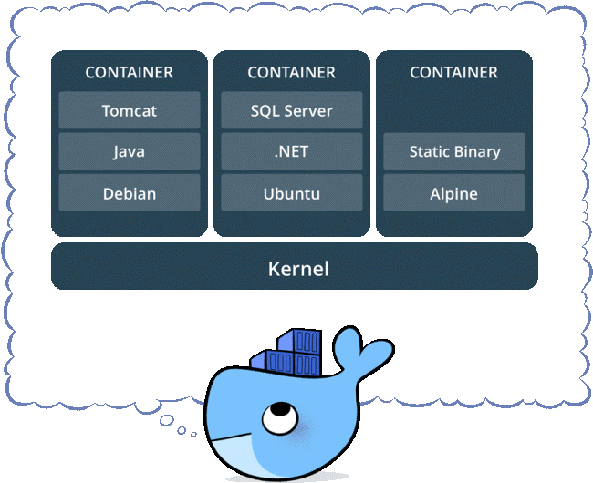
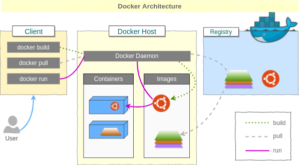
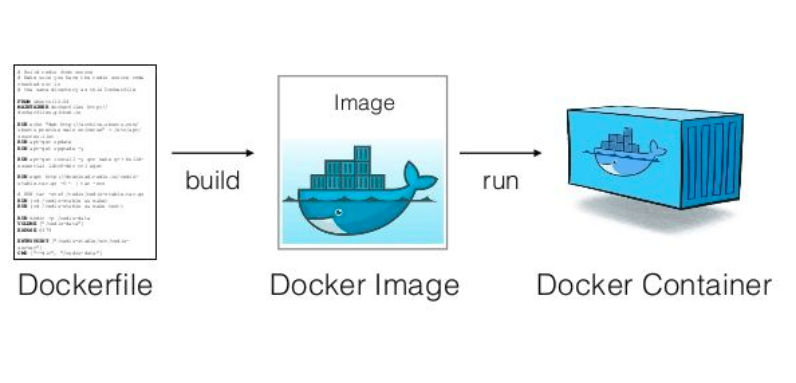

# DOCKER

## 1. Containers

### What are containers ?

Container là một phần mềm đóng gói application's code, cô lập application với toàn bộ runtime environment sao cho application có thể chạy như nhau trong nhiều môi trường khác nhau. 

Để làm được điều đó, Container tận dụng một dạng của operating system virtualization (ví dụ như namespace và cgroups primitives của Linux kernel) để cô lâp các processes và kiểm soát những phần mà các processes đó truy cập tới (như CPU, memory, disk).

Container rất nhanh và gọn nhẹ, không giống như virtual machine, container không ảo hóa cả một hệ điều hành mà tận dung luôn các tính năng và nguồn lực của host OS.

### Containers vs. Virtual machine

Virtual machine (VM) là một phần mềm mô phỏng một hệ thống máy tính (như mô phỏng một hệ điều hành). VM với các guest OS (như Linux hay Windows) chạy trên nền host OS, sau đó các ứng dụng sẽ chạy trên các guest OS này. VM cung cấp khả năng cô lập rất cao giữa application và environment. Containers cũng cung cấp khả năng này nhưng gọn nhẹ hơn nhiều. 

Container có nhiều điểm khác biệt so với VM nhưng khác nhau cơ bản nhất là:
- Container đo bằng megabyte. Container không đóng gói thứ gì lớn hơn một application và tất cả những gì cần thiết để để run application đó. Containers share operating system (chỉ dùng một OS) nên rất gọn nhẹ và dễ dàng di chuyển giữa nhiều môi trường.
- VM đo bằng gigabyte. VM chứa hệ điều hành của chính nó, cho phép giả lập nhiều functions và hệ thống phức tạp (như các hệ điều hành, desktop, database, networks).

### Benefits of Containers ?

- Lightweight: Containers share the OS kernel, không cần ảo hóa cả một hệ điều hành cho mỗi application làm cho Container files nhỏ gọn và hoạt động nhanh hơn.

- Isolation: Container ảo hóa CPU, memory, storage và resources ở OS-level, cung cấp một khả năng cô lập application so với các application khác.

- Consistent Environment: Containers cung cấp một môi trường như nhau trên nhiều platform khác nhau, dễ dàng hơn cho developers để config, code và dubugging.

- Portable and platform independent: Application có thể được viết một lần và chạy trên nhiều lần mà không cần re-configured trên nhiều môi trường như laptops, destop, cloud,...

## 2. Docker

Docker là một nền tảng cho developers và sysadmin để develop, deploy và run application với container. 

### Một số khái niệm

- Docker Client: là cách mà bạn tương tác với docker thông qua command trong terminal. Docker Client sẽ sử dụng API gửi lệnh tới Docker Daemon.
- Docker Daemon: là server Docker cho yêu cầu từ Docker API. Nó quản lý images, containers, networks và volume.
- Docker Volumes: là cách tốt nhất để lưu trữ dữ liệu liên tục cho việc sử dụng và tạo apps.
- Docker Registry: là nơi lưu trữ riêng của Docker Images. Images được push vào registry và client sẽ pull images từ registry. Có thể sử dụng registry của riêng bạn hoặc registry của nhà cung cấp như : AWS, Google Cloud, Microsoft Azure.
Docker Hub: là Registry lớn nhất của Docker Images ( mặc định). Có thể tìm thấy images và lưu trữ images của riêng bạn trên Docker Hub ( miễn phí).
- Docker Repository: là tập hợp các Docker Images cùng tên nhưng khác tags. VD: golang:1.11-alpine.
Docker Networking: cho phép kết nối các container lại với nhau. Kết nối này có thể trên 1 host hoặc nhiều host.
- Docker Compose: là công cụ cho phép run app với nhiều Docker containers 1 cách dễ dàng hơn. Docker Compose cho phép ta config các command trong file docker-compose.yml để sử dụng lại. Có sẵn khi cài Docker.
- Docker Swarm: để phối hợp triển khai container.
- Docker Services: là các containers trong production. 1 service chỉ run 1 image nhưng nó mã hoá cách thức để run image — sử dụng port nào, bao nhiêu bản sao container run để service có hiệu năng cần thiết và ngay lập tức.

### Docker image

Docker image là nền tảng của container, có thể hiểu Docker image như khung xương giúp định hình cho container, nó sẽ tạo ra container khi thực hiện câu lệnh chạy image đó.

Image này không phải là một file vật lý mà nó chỉ được chứa trong Docker.

Một image bao gồm hệ điều hành (Windows, CentOS, Ubuntu, …) và các môi trường lập trình được cài sẵn (httpd, mysqld, nginx, python, git, …).

Docker hub là nơi lưu giữ và chia sẻ các file images này (hiện có khoảng 300.000 images)

### Dockerfile

Dockerfile là một file dạng text, không có đuôi, giúp thiết lập cấu trúc cho docker image nhờ chứa một tập hợp các câu lệnh.

Từ những câu lệnh đó, Docker có thể thực hiện đóng gói một docker images theo yêu cầu.

### Các lệnh cơ bản

[Tham khảo](https://viblo.asia/p/docker-chua-biet-gi-den-biet-dung-phan-2-dockerfile-RQqKLzeOl7z)

## 3. Bài tập

