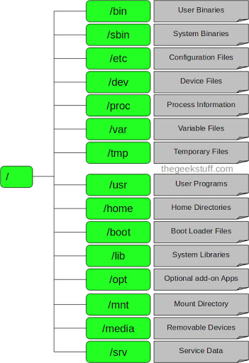
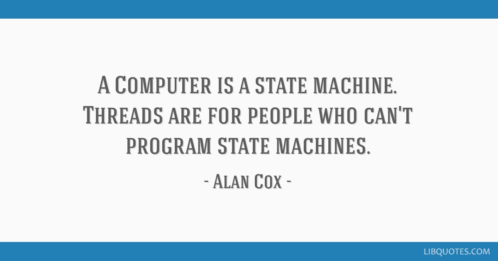

# Linux System Programming

### 2.1 File và File System

triết lý "everything is a file"

[link](https://www.youtube.com/watch?v=dDwXnB6XeiA)

<ins>File descriptor</ins>

Kernel duy trì một per-process list of open files, gọi là file table. Table này được index bởi một số tự nhiên không âm gọi là File descriptors.  Mỗi thành phần trong list chứa thông tin về open file, mode, con trỏ tới backing inode và metadata của file đó trong in-memory (metadata thông tin về vị trí file, access mode,...).

Mỗi process mặc định có 3 file descriptors open: 0, 1, 2. File descriptor 0 là standard in (stdin), file descriptor 1 là standard out (stdout), file descriptor 2 là standard erorr (stderr).

File descriptor không hẳn chỉ dùng cho file thông thường, mà là một abstract indicator dùng để giao tiếp với hầu như mọi thứ trong hệ thống linux, như device files, directories, pipe, network socket,... Linux tuân theo một triết lý "everything is a file".

<ins>File system</ins>

Hệ thống file của linux

Mọi file đều là con của thư mục / (Root)

Trong thư mục root thường có những thư mục sau:

- /bin – User Binaries
Đối lập với /sbin/ thư mục này chứa rất nhiều ứng dụng khác nhau dùng được cả cho việc bảo trì hệ thống của root, cũng như các lệnh cho người dùng thông thường. Thư mục này thông thường chứa hệ vỏ (Shell), cũng như rất nhiều lệnh hữu dụng như cp (sao chép), mv (di chuyển), cat, ls. Cũng giống như sbin, thư mục /usr/bin cũng chứa các tệp tin có chức năng tương tự như /bin.

- /sbin – System Binaries
Chứa đựng các file thực thi dạng binary (nhị phân) của các chương trình cơ bản giúp hệ thống có thể hoạt động. Các lệnh bên trong /sbin thường được sử dụng dùng cho các mục đích là duy trì quản trị hệ thống. Các lệnh này yêu cầu phải có quyền root.
Một số lệnh trong đây ví dụ: lilo, fdisk, init, ifconfig v.v.. Để liệt kê, bạn dùng lệnh “ls /sbin/”.
Còn một thư mục mà nó chứa các tệp tin thi hành cho hệ thống là /usr/sbin/. Nhưng các chương trình ở đây không được sử dụng để bảo trì hệ thống.

- /etc – Configuration Files
Chứa file cấu hình cho các chương trình hoạt động. Chúng thường là các tệp tin dạng text thường. Ví dụ:
/etc/resolv.conf (cấu hình dns-server )
/etc/network dùng để quản lý dịch vụ network
Ở /etc có một thư mục quan trọng là /etc/rc.d. Nơi đây thường chứa các scripts dùng để start, stop, kiểm tra status cho các chương trình.

- /boot – Boot Loader Files
Chứa các tệp tin khởi động kernel là vmlinuz, dữ liệu cho grub. Phần mềm khởi động Grub (viết tắt của GRand Unified Boot loader).

- /dev – Device Files
Đây là một thư mục thú vị nhất, nó thể hiện một cách rõ ràng là hệ điều hành Linux coi mọi thứ đều là các tệp tin và thư mục.
Trong thư mục này bạn có thể thấy rất nhiều tệp tin đại diện cho các thiết bị như ổ đĩa SATA, cổng COM v.v.. Bạn liệt kê chúng ra bằng lệnh “ls /dev/”. Bạn sẽ thấy rất nhiều nhưng không phải chúng đều có thật trên máy tính của bạn đâu nhé. Chẳng hạn bạn chỉ có một cổng COM nhưng ở đây bạn sẽ thấy không chỉ có một.
Ví dụ:
/dev/sda : đây là ổ đĩa SATA thứ nhất
/dev/cdrom : ổ CD
/dev/ttyS0 : cổng COM1

- /home – Home Directories
Thư mục Home. Thư mục này chứa thông tin, dữ liệu , cấu hình riêng cho từng user. Nó giống như thư mục “C:\Documents and Settings” trong Windows XP.

- /lib – System Libraries
Chứa các file library hỗ trợ cho các file thực binary. Tên của các file library thường là ld* or lib*.so.* . Ví dụ như libc.so.* (Thư viện C).

- /lost+found
Vì một lý do bất ngờ nào đó như lỗi phần mềm, mất điện v..v, hệ thống có thể đổ vỡ. Khi khởi động lại, hệ thống sẽ kiểm tra lại hệ thống filesystem bằng lệnh fchk và cố gắng phục hồi lại các lỗi mà nó tìm thấy. Kết quả của việc này sẽ được lưu giữ trong thư mục /lost+found.

- /mnt – Mount Directory
Chứa các thư mục dùng để system admin thực hiện quá trình mount. Như đã nói, hệ điều hành Linux coi tất cả là các file và lưu giữ trên một cây chung. Đây chính nơi tạo ra các thư mục để ‘gắn’ các phân vùng ổ đĩa cứng cũng như các thiết bị khác vào. Sau khi được mount vào đây, các thiết bị hay ổ cứng được truy cập từ đây như là một thư mục. Trong một số hệ điều hành, các ổ đĩa chưa được gắn sẵn vào hệ thống bởi fstab sẽ được gắn ở đây. Về cách gắn và tháo, có lẽ cần một bài viết riêng.

- /opt – Optional add-on Applications
Chứa các phần mềm và phần mở rộng không nằm trong phần cài đặt mặc định, thường là của hãng thứ ba.

- /proc – Process Information
Chứa đựng thông tin về quá trình xử lý của hệ thống
Đây là một pseudo filesystem chứa đựng các thông tin về các process đang chạy
Đây là một virtual filesystem chứa đựng các thông tin tài nguyên hệ thống. Ví dụ:/proc/cpuinfo cung cấp cho ta thông số kỹ thuật của CPU. Để xem bạn dùng lệnh ‘cat’:

    $cat /proc/cpuinfo

- /tmp – Temporary Files
Thư mục này chứa các file được tạo với mục đích dùng tạm thời bởi hệ thống cũng như user. Các file bên dưới thư mục này được xóa đi khi hệ thống reboot hay shutdown.

- /usr – User Programs
Chứa các file binary, library, tài liệu, source-code cho các chương trình

    /usr/bin chứa file binary cho các chương trình của user. Nếu như một user trong quá trình thực thi một lệnh ban đầu sẽ tìm kiếm trong /bin, nếu như không có thì sẽ tiếp tục nhìn vào /usr/bin. Ví dụ một số lệnh như at. awk, cc…
    /usr/sbin chứa các file binary cho system administrator. Nếu như ta không tìm thấy các file system binary bên dưới /sbin thì ta có thể tìm ở trong /usr/sbin. Ví dụ một số lệnh nhưcron, sshd, useradd, userdel
    /usr/lib chứa các file libraries cho /usr/bin và /usr/sbin
    /usr/local dùng để chứa chương trình của các user, các chương trình này được cài đặt từ source. Ví dụ khi ta install apache từ source thì nó sẽ nằm ở vị trí là/usr/local/apache2

- /media – Removable Media Devices
Chứa thư mục dùng để mount cho các thiết bị removable. Ví dụ như CDROM, Floppy v.v.

- /var – Variable Files
Chứa đựng các file có sự thay đổi trong quá trình hoạt động của hệ điều hành cũng như các ứng dụng. Ví dụ:
    + Nhật ký của hệ thống /var/log
    + database file /var/lib
    + email /var/mail
    + Các hàng đợi in ấn: /var/spool
    + lock file: /var/lock
    + Các file tạm thời cần cho quá trình reboot: /var/tmp
    + Dữ liệu cho trang web: /var/www
    Để biết được thư mục đang nằm trên phân vùng nào các bạn hãy sử dụng lệnh df với đối số là dấu chấm (.) biểu diễn thư mục hiện hành.

### 2.2 Process & Thread

#### Multi-threading

Thread là chuỗi nhỏ nhất các lệnh lập trình đang được thực thi, được quản lý bởi bộ định thời của hệ điều hành.

Thead là một phần của Process. Các khái niệm về thread và process có thể dễ bị lẫn lộn. Một chương trình máy tính đang chạy được gọi là một process. Process và Thread có những sự khác biệt cơ bản như sau:

| Process | Thread |
|---------|--------|
| Là một chương trình đang chạy | Là một phần của process |
| Process là một cá thể thực thi riêng biệt và không dùng chung data, information với các process khác | Threads share data giữa các threads trong cùng một process |
| Dùng cơ chế IPC (inter-process communication) để giao tiếp với các process khác, đòi hỏi nhiều system calls | Giao tiếp giữa các thread sử dụng shared memory |
| Tạo nhiều process đòi hỏi các system calls riêng biệt cho mỗi process | Một system call có thể tạo nhiều thread |

Multi-threading là khả năng của một CPU (hoặc một core trong CPU) xử lý nhiều thread cùng một lúc (concurrently), hỗ trợ bởi hệ điều hành.

#### Lợi ích của multi-threading

- Dễ lập trình: nhiều bài toán dễ lập trình hơn nếu chia thành nhiều công việc riêng việt rồi giao cho các thread.

- Xử lý song song: Nếu có nhiều hơn một core, hay nhiều hơn một CPU, các thread có thể được xử lý song song trên nhiều core và cpu đó.

- Tăng khả năng phản hồi của chương trình: nếu một thread đang bận xử lý một chuỗi công việc dài thì ta có thể giao tiếp với user cho một thread khác, 2 thread hoạt động cùng nhau => ta có một chương trình vừa xử lý và giao tiếp với user cùng lúc (concurrenly).

- Blocking I/O: Nếu chỉ  có 1 thread, 1 blocking I/O có thể chặn đứng cả chương trình. Tương tự như khả năng phản hồi được nêu ở trên, nếu có nhiều thread, một số thread có thể bị block nhưng vẫn còn nhiều thread tiếp tục công việc.

- Việc CPU chuyển đổi giữa 2 thread trong cùng một process tốn rất ít chi phí (so sánh với việc chuyển đổi giữa 2 process).

- Minimized resource usage của hệ thống: các thread dùng chung memory, việc giao tiếp giữa các thread trong cùng một process cũng dễ dàng hơn do cơ chế share memory này (so sánh với multi-processing).

#### Các vấn đề với multi-threading

- Khi số lượng thread tăng lên và phần lớn trong chúng bị block, lúc đó hệ thông đang phí phạm một lượng lớn tài nguyên để tạo và duy trì các thread.

- Debug trong multi-threading là rất khó. Vì chuyển đổi giữa các thread là do hệ điều hành quyết định nên việc design và hiểu một chương trình multi-threading không hề dễ dàng.

- Các thread share memory với nhau, đọc ghi trên cùng môt vùng nhớ, cùng data, vì không thể đoán trước CPU sẽ switch giữa các thread như thế nào dẫn tới những vấn đề nhức nhối nhất với multi-threading: các thread không đồng bộ, race condition, deadlock. Dẫn tới output không mong muốn, thực thi sai thậm chí là crash chương trình. 

#### Race condition

#### Deadlock

### 2.3 Synchronizaion

#### Semaphore

#### Reader Writer Problem

### 2.4 Networking

## Phần thực hành

[hay](https://vimentor.com)